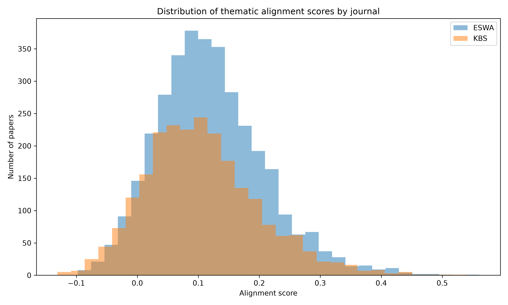
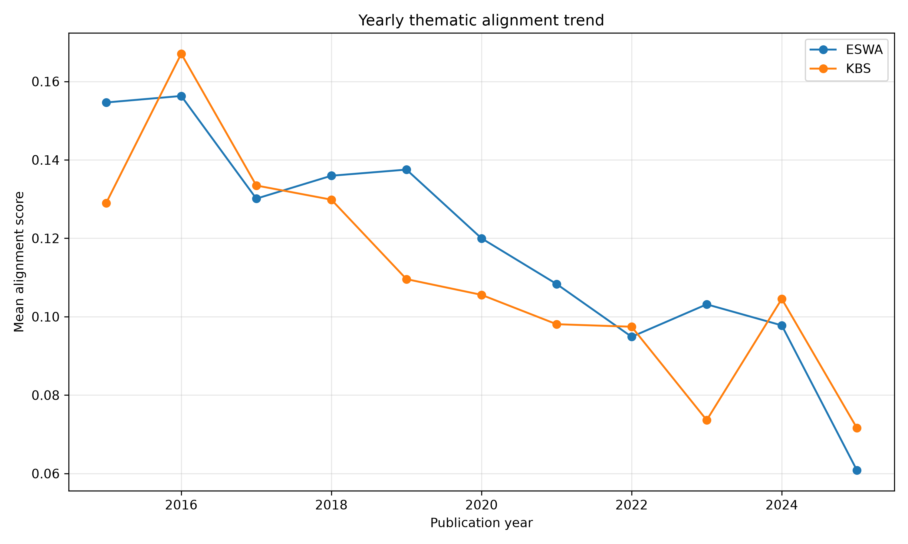
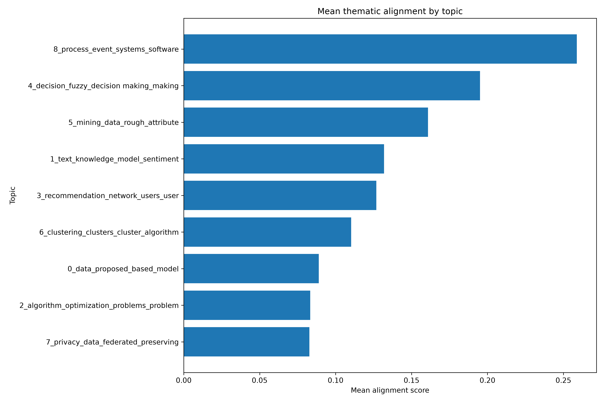
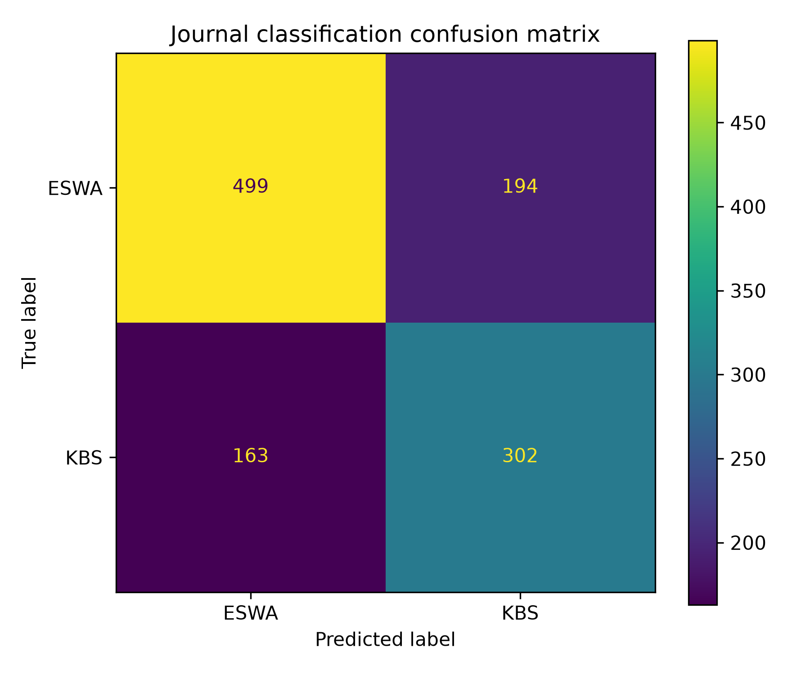

# Measuring Thematic Alignment and Drift in AI Journals: A Sentence-BERT and BERTopic Study of ESWA and KBS (2015–2025)

LAKSHMI UMESH  (54470A)  
Natural Language Processing    
University of Milan  
2026
## Abstract

Scientific journals define their academic identity through their Aims & Scope statements. However, the actual themes that are reflected in published papers might shift throughout time due to evolution of the research field. This issue is especially relevant in Artificial Intelligence, where new methods, applications, and technical subfields emerge quickly. This project investigates whether articles published in two AI-related journals, *Expert Systems with Applications* and *Knowledge-Based Systems*, remained thematically aligned with their journal scopes between 2015 and 2025.

The study uses a dataset of 5,788 cleaned article abstracts collected from Semantic Scholar.  Sentence-BERT embeddings were generated for journal Aims & Scope and article abstracts. Cosine similarity was used as the main alignment score. BERTopic was then used to identify major thematic areas in the corpus. Statistical trend analysis was applied to examine whether the thematic alignment has shifted over time.In addition, a TF-IDF and Logistic Regression classifier was trained to test whether the two journals could be distinguished based on article abstracts.

The results show a weak but statistically significant decrease in thematic alignment over time for both journals.*Expert Systems with Applications* showed slightly higher average alignment than *Knowledge-Based Systems*. Topic modeling and outlier inspection suggest that lower-alignment papers were often not irrelevant, but rather belonged to new or highly specialized AI fields  such as deep learning, biomedical segmentation, privacy-preserving learning, and optimization. Overall, the study illustrates how NLP methods can be used to investigate  thematic coherence, drift, and editorial focus in scientific publishing.

**Keywords:** thematic alignment, scientific journals, Sentence-BERT, BERTopic, topic modeling, semantic similarity, TF-IDF, Artificial Intelligence

## 1. Introduction

Scientific journals play an important role in organizing research communities. A journal is not only a publication venue; it is an intellectual space that is represented  through the journal’s Aims & Scope statement, which explains the topics, methods, and types of contributions the journal intends to publish.

However, research fields are not static. Artificial Intelligence is a clear example of a field that has changed significantly in recent years. In past years,AI research was often focused on expert systems, knowledge representation, symbolic reasoning, decision support, and rule-based intelligent systems. Recent research in AI increasingly includes machine learning, deep learning, computer vision, natural language processing, privacy-preserving learning, and domain-specific AI applications. Because of this evolution, it is useful to find whether the articles published in AI journals still comply with the thematic focus described in their Aims & Scope statements.

This project addresses that question using Natural Language Processing methods. The basic  idea is to compare the semantic meaning of each article abstract with the semantic meaning of the journal’s Aims & Scope. An abstract with higher semantic similarity will have a higher alignment score, whereas one with less semantic similarity will have a lower alignment score.  By calculating this score for numerous articles across several years, it becomes possible to observe whether thematic alignment remains stable or it demonstrate evidence of drift.

 The preprocessing stage involves text cleaning and normalization. The classifier baseline uses TF-IDF features and Logistic Regression, which relates the project to classical vector-space models and linear classification. The main alignment method uses Sentence-BERT embeddings, connecting the project to neural text encoding, word and sentence representations, Transformers, and BERT-style models. Thus, the project implements both traditional NLP techniques and modern transformer-based semantic modeling.

The study focuses on two journals: *Expert Systems with Applications* and *Knowledge-Based Systems*. Both journals are strongly related to Artificial Intelligence, intelligent systems, decision support, and knowledge-based methods. At the same time, both journals publish a wide range of applied and technical research, which makes them suitable case studies for analyzing thematic alignment and drift.

The aim of the project is not to evaluate whether individual papers should or should not have been published. Instead, the idea is to measure thematic proximity and interpret general patterns. A low alignment score does not necessarily mean that a paper is outside the journal’s scope. It may simply indicate that the paper uses newer terminology, focuses on a specialized application, or belongs to an emerging subfield that is less directly represented in the scope statement.

## 2. Research Question and Methodology

### 2.1 Research Question

The main research question of this project is:

**How has thematic alignment between published articles and journal Aims & Scope evolved in selected Artificial Intelligence journals between 2015 and 2025?**

The project also considers three supporting questions:

1.Is there evidence of thematic drift over time in the selected journals?  
2.Which topics are most and least aligned with the journal scopes?  
3.Are the two journals thematically distinguishable based on their article abstracts?

### 2.2 Measurable Objectives

The project has the following measurable objectives:

- Collect and clean article abstracts from two AI-related journals for the period 2015–2025.
- Represent each journal scope and each article abstract using semantic embeddings.
- Compute an alignment score for every article using cosine similarity.
- Analyze yearly changes in alignment scores to find possible thematic drift.
- Use BERTopic to identify major thematic areas in the corpus.
- Compare the two journals using statistical tests.
- Train a classifier baseline to test whether the journals are distinguishable from abstracts.
- Inspect high-alignment and low-alignment papers qualitatively.

### 2.3 Formal Problem Definition

Let each journal be represented by an Aims & Scope text `S_j`, where `j` identifies the journal. Each article `i` published in journal `j` is represented by its abstract `A_i`. The goal is to measure the semantic proximity between the article abstract `A_i` and the corresponding journal scope `S_j`.

A sentence embedding model `f` is used to map both texts into a shared vector space. The abstract embedding is defined as:

`v_i = f(A_i)`

The journal scope embedding is defined as:

`s_j = f(S_j)`

The thematic alignment score for article `i` is then calculated as the cosine similarity between the article abstract embedding and the journal scope embedding:

`Alignment(A_i, S_j) = cos(v_i, s_j)`

A higher score indicates stronger semantic proximity between the article abstract and the journal scope. A lower score indicates weaker semantic proximity. The score is then analyzed by journal, year, and topic.

### 2.4 Dataset and Preprocessing

The dataset was collected from Semantic Scholar. The collected metadata includes article titles, abstracts, publication years, journal names, paper identifiers, URLs, citation counts, and related fields of study.

The analysis focuses on articles published between 2015 and 2025 in two journals:

- *Expert Systems with Applications* (ESWA)
- *Knowledge-Based Systems* (KBS)

The raw data was cleaned before analysis. Papers without abstracts were removed because the project depends on abstract-level semantic comparison. Duplicate paper IDs were removed to avoid counting the same article more than once. Very short abstracts were also excluded because they may not contain enough information for reliable semantic analysis.

After preprocessing, the final cleaned dataset contained 5,788 papers: 3,465 from ESWA and 2,323 from KBS.

### 2.5 Sentence-BERT Alignment Method

For each journal, the Aims & Scope text was saved as a reference document. This text was treated as the thematic reference point of the journal. Each article abstract was then compared with the corresponding journal scope.

Sentence-BERT was used to convert both the journal scope texts and the article abstracts into dense semantic embeddings. This approach is suitable because it compares texts based on meaning rather than only exact word overlap. For example, two texts may be thematically similar even if they use different vocabulary. This is important in scientific publishing, where related ideas may be expressed using different technical terms.

The main alignment metric is cosine similarity. A higher cosine similarity indicates that an abstract is closer to the journal scope in the embedding space. However, this metric should be interpreted carefully. It measures semantic proximity to the scope text, not the academic quality or publication suitability of the article.

### 2.6 Topic Modeling with BERTopic

BERTopic was used to identify major thematic areas in the dataset. A single topic model was trained using abstracts from both journals. This made it possible to compare the same topic structure across ESWA and KBS.

Stopword removal and bigram extraction were used to improve the interpretability of the extracted topics. Topic modeling was included because the alignment score alone does not explain why some papers are more or less aligned. By examining topics, it becomes possible to identify which research areas are closer to the journal scope and which areas may represent newer or more specialized directions.

### 2.7 Statistical Analysis and Classifier Baseline

To examine thematic drift, alignment scores were summarized by journal and year. Spearman correlation was used to measure whether alignment scores generally increased or decreased over time. Linear regression was used to estimate the direction and strength of the yearly trend.

A Mann-Whitney U test was used to compare the alignment score distributions of ESWA and KBS. This helped to determine whether one journal showed significantly higher alignment than the other.

As an additional experiment, a TF-IDF and Logistic Regression classifier was trained to predict whether an abstract came from ESWA or KBS. This classifier was not the main method of the project. It was included as a baseline to test whether the two journals are thematically distinguishable using abstract text alone.

## 3. Experimental Results
### 3.1 Dataset

The final cleaned dataset contains 5,788 papers. ESWA contributes 3,465 papers, while KBS contributes 2,323 papers.

**Table 1. Number of cleaned papers per journal**

| Journal | Short name | Number of papers |
|---|---:|---:|
| *Expert Systems with Applications* | ESWA | 3,465 |
| *Knowledge-Based Systems* | KBS | 2,323 |
| **Total** |  | **5,788** |

The dataset shows that both journals had a relatively large number of collected papers during the period from 2018 to 2021. For example, ESWA has 950 papers in 2020 and 697 papers in 2021, while KBS has 772 papers in 2020 and 395 papers in 2021. Later years contain fewer papers in the collected dataset, which should be considered when discussing the trend results.

### 3.2 Evaluation Metrics

The main evaluation metric is the alignment score, calculated as cosine similarity between the Sentence-BERT embedding of an article abstract and the embedding of the corresponding journal Aims & Scope.

The following metrics and analyses were used:

- Mean and median alignment scores to summarize overall alignment.
- Yearly mean alignment scores to examine temporal change.
- Spearman correlation to measure monotonic association between year and alignment.
- Linear regression slope and R-squared to estimate the direction and strength of drift.
- Mann-Whitney U test to compare journal-level alignment distributions.
- BERTopic topic-level mean alignment to interpret thematic areas.
- Precision, recall, F1-score, and accuracy for the classifier baseline.

### 3.3 Overall Alignment Results

The overall alignment scores show that ESWA has a slightly higher average alignment than KBS. The mean alignment score for ESWA is 0.120, with a median of 0.111. For KBS, the mean alignment score is 0.106, with a median of 0.098.

**Table 2. Overall alignment summary**

| Journal | Mean alignment | Median alignment | Standard deviation | Minimum | Maximum | Papers |
|---|---:|---:|---:|---:|---:|---:|
| ESWA | 0.120 | 0.111 | 0.088 | -0.098 | 0.561 | 3,465 |
| KBS | 0.106 | 0.098 | 0.093 | -0.131 | 0.540 | 2,323 |

This difference suggests that, according to the embedding-based metric, articles in ESWA are slightly closer to their journal scope than articles in KBS. However, the difference is not large. Since both journals publish research in related areas of Artificial Intelligence, intelligent systems, and knowledge-based methods, a considerable amount of thematic overlap is expected.

**Figure 1. Alignment score distribution by journal**

### 3.4 Thematic Drift Over Time

The trend analysis shows a weak negative relationship between publication year and alignment score for both journals. For ESWA, the Spearman correlation is approximately -0.193. For KBS, it is approximately -0.156. In both cases, the p-values are very small, indicating that the trends are statistically significant.

**Table 3. Trend statistics**

| Journal | Spearman correlation | Spearman p-value | Linear slope | Linear p-value | R-squared |
|---|---:|---:|---:|---:|---:|
| ESWA | -0.193 | 2.58e-30 | -0.0094 | 4.15e-33 | 0.041 |
| KBS | -0.156 | 4.47e-14 | -0.0075 | 5.29e-14 | 0.024 |

The linear regression results also show negative slopes for both journals. This means that, on average, alignment scores slightly decrease over time. The decrease is more visible when comparing earlier years such as 2015 and 2016 with later years such as 2023 and 2025.

However, the strength of the trend is limited. The R-squared values are low, meaning that publication year explains only a small part of the variation in alignment scores. Therefore, the result should not be overstated. The evidence suggests gradual thematic drift, but not a dramatic departure from the journals’ scopes.

A reasonable interpretation is that both journals have expanded their published content toward newer and more specialized AI topics over time. This does not necessarily mean that the journals are losing focus. Instead, it may reflect the natural evolution of the AI field.

**Figure 2. Yearly alignment trend**

### 3.5 Comparison Between Journals
The Mann-Whitney U test shows a statistically significant difference between the alignment score distributions of ESWA and KBS. ESWA has a higher median alignment score than KBS.

**Table 4. Journal comparison using Mann-Whitney U test**

| Journal A | Journal B | Mean A | Mean B | Median A | Median B |  p-value |
| --------- | --------- | -----: | -----: | -------: | -------: | -------: |
| ESWA      | KBS       |  0.120 |  0.106 |    0.111 |    0.098 | 2.39e-10 |

This supports the earlier observation that ESWA is slightly more aligned with its scope according to the selected metric. Still, the practical difference is small, and both journals remain within a similar thematic area. The result should therefore be interpreted as a modest difference rather than a strong separation.

### 3.6 Topic Modeling Results
BERTopic identified nine main topics in the dataset. The most aligned topic was related to process systems, event systems, and software, with a mean alignment score of approximately 0.259. Other highly aligned topics included fuzzy decision-making, rule-based knowledge discovery, knowledge modeling, recommendation systems, and clustering.

**Table 5. Topic alignment summary**

| Topic ID | Topic label | Count | Mean alignment |
|---:|---|---:|---:|
| 8 | Process, event systems, and software | 65 | 0.259 |
| 4 | Fuzzy decision-making and decision support | 324 | 0.195 |
| 5 | Data mining, rough sets, and rule-based knowledge discovery | 138 | 0.161 |
| 1 | Text mining, semantic knowledge, and language analysis | 655 | 0.132 |
| 3 | Recommender systems and network-based user modeling | 533 | 0.127 |
| 6 | Clustering algorithms and cluster validation | 82 | 0.110 |
| 0 | General machine learning models and predictive methods | 2,195 | 0.089 |
| 2 | Optimization algorithms and search methods | 581 | 0.083 |
| 7 | Privacy-preserving and federated learning | 68 | 0.083 |
The highly aligned topics are closely connected to the journals’ stated interest in expert systems, knowledge-based systems, intelligent decision support, and applied AI methods.

The least aligned topics include broader machine learning models, optimization algorithms, privacy-preserving learning, and federated learning. These topics are not outside AI, but their vocabulary is less directly connected to the traditional language of expert systems and knowledge-based systems.

This result helps explain the observed thematic drift. The decrease in alignment over time may be partly caused by the rise of newer AI subfields whose terminology differs from the wording used in the original scope statements.

**Figure 3. Topic alignment by topic**

### 3.7 Classifier Baseline Results

The TF-IDF and Logistic Regression classifier achieved an accuracy of approximately 69.2% when predicting whether an abstract belonged to ESWA or KBS. This is higher than the majority-class baseline of approximately 59.9%.

**Table 6. Classifier performance**

| Class | Precision | Recall | F1-score | Support |
|---|---:|---:|---:|---:|
| ESWA | 0.754 | 0.720 | 0.737 | 693 |
| KBS | 0.609 | 0.649 | 0.629 | 465 |
| Accuracy |  |  | 0.692 | 1,158 |
| Macro average | 0.681 | 0.685 | 0.683 | 1,158 |
| Weighted average | 0.696 | 0.692 | 0.693 | 1,158 |

This result suggests that the two journals are thematically distinguishable to some extent. The classifier can identify differences in the vocabulary and themes of the abstracts. However, the accuracy is moderate rather than high. This is expected because the journals overlap significantly in their focus on Artificial Intelligence, intelligent systems, decision support, and knowledge-based methods.

The classifier result therefore supports a balanced interpretation: the two journals are not identical in thematic focus, but they are also not completely separate.

**Figure 4. Classifier confusion matrix**

### 3.8 Outlier Analysis
The outlier inspection provides a qualitative check on the alignment scores. The highest-alignment papers often contain terms and ideas directly related to the journal scopes, such as expert systems, knowledge acquisition, decision models, fuzzy logic, knowledge configuration, and knowledge graphs.

Examples of high-alignment papers include:

- “Monitoring electrical systems data-network equipment by means of Fuzzy and Paraconsistent Annotated Logic”
- “A multi-disciplinary review of knowledge acquisition methods”
- “Knowledge configuration model for fast derivation design of electronic equipment”
- “Capturing and Anticipating User Intents in Data Analytics via Knowledge Graphs”

In contrast, the lowest-alignment papers often focus on more specialized technical subjects such as generative adversarial networks, biomedical image segmentation, code-switched emotion detection, video colorization, convolutional neural networks, and binary sequence optimization.

Examples of low-alignment papers include:

- “ROIsGAN: A Region Guided Generative Adversarial Framework for Murine Hippocampal Subregion Segmentation”
- “Leveraging bilingual-view parallel translation for code-switched emotion detection”
- “MVGFormer: Multi-view perspective with graph-guided transformer for cryo-ET segmentation”
- “Exemplar-based Video Colorization with Long-term Spatiotemporal Dependency”

These topics are still related to Artificial Intelligence, but their abstracts are less directly connected to the wording of the journal Aims & Scope. This confirms that the alignment score is useful, but it also has limitations. Low alignment should be interpreted as lower semantic proximity, not as proof that a paper is unsuitable for the journal.

## 4. Conclusion

### 4.1 Critical Discussion of Results

The results indicate  that thematic alignment in both journals has slightly declined over time. This finding support with the idea that Artificial Intelligence has expanded into many new technical and application-driven areas.As such, the content of the journal may also change with time,  even if the formal Aims & Scope text remains relatively stable.

This trend can be explained by the results of topic modeling. Topics closely related to knowledge-based systems, decision support, fuzzy decision-making, and rule-based systems show higher alignment.This is because of their alignment with the traditional identity of the chosen journals. In contrast, newer areas such as privacy-preserving learning, federated learning, deep learning-based segmentation, and advanced optimization show lower alignment. This does not mean these topics are irrelevant. Rather, it indicates that their language and focus may be less directly represented in the journal scope statements.

The classifier baseline adds another perspective. Since the classifier achieved around 69.2% accuracy, the two journals are distinct enough from each other. However, the moderate accuracy also shows that their thematic boundaries are not strict. This makes sense because both journals belong to overlapping areas of AI research.

Overall,  the findings should be interpreted carefully.There is evidence of thematic drift, but the drift is weak. The journals appear to remain broadly connected to their scopes while also adapting to changes in the AI research landscape.

### 4.2 Limitations

This project has several limitations. First, the analysis is based only on article abstracts. Abstracts provide a useful summary of a paper, but they may not fully represent the paper’s complete content. Full-text analysis could provide a richer view of thematic alignment.

The second limitation of the project is that the current version of the Aims & Scope text serves as the basis for comparison for all the papers from 2015 to 2025. The scope of journals may also change over time.If historical versions of the Aims & Scope were available, the analysis could compare each paper with the scope statement from the same period.

Third, the alignment score relies on the embedding model. Sentence-BERT is suitable for semantic similarity tasks, but different embedding models may produce slightly different scores.In the future, we might consider testing the robustness of our results through comparing multiple embedding models.

Fourth, the dataset depends on the availability and quality of Semantic Scholar metadata.  There can be articles absent, duplicated, or having incorrect metadata.Although preprocessing steps were applied, the collected dataset may not perfectly represent the complete publication history of both journals.

Finally, the topic labels identified by BERTopic need interpretation. Although representative keywords help identify topic meaning, manual inspection is still necessary to avoid over-interpreting automatically generated labels.

### 4.3 Future Work

Future work could extend the analysis in several directions. The full-text articles could be used instead of abstracts to obtain a detailed representation of each paper. Secondly, historical versions of journal Aims & Scope statements could be collected to test whether the scope itself changed over time. Third, the study could be expanded to include more AI journals, allowing a broader comparison of thematic drift across the field.

The other possible extension would be to compare different embedding models. For example, domain-specific scientific language models could be tested against general Sentence-BERT models. This would help evaluate whether the observed alignment patterns are robust across different semantic representation methods.

Finally, explainability methods can be applied to better understand which words or phrases contribute most strongly to high or low alignment scores.

### 4.4 Final Remarks

The aim of this study was to construct a replicable NLP pipeline for measuring thematic alignment between journal Aims & Scope statements and published article abstracts. Using Sentence-BERT embeddings and cosine similarity, the study calculated alignment scores for articles published in *Expert Systems with Applications* and *Knowledge-Based Systems* between 2015 and 2025.

The findings show that both journals remain broadly connected to their stated scopes, but there is evidence of weak thematic drift over time. ESWA shows slightly higher alignment than KBS, although the difference is not significant. Topic modeling suggests that papers related to knowledge-based systems, decision support, fuzzy logic, and rule-based methods are more aligned, while newer or more specialized AI areas tend to show lower alignment.

The classifier baseline shows that the two journals are thematically distinguishable from abstracts to some extent,although there is considerable thematic overlap between them. Therefore, it is reasonable to say that the publications share related but different thematic profile.

Overall, the project shows that NLP methods can support the study of scientific publishing by making it possible to quantify thematic coherence, identify drift, and inspect outlier papers. At the same time, the results should be interpreted critically because alignment scores measure semantic proximity, not academic relevance or publication quality.

## AI Usage Disclaimer

Parts of this project were developed with the assistance of OpenAI’s ChatGPT (GPT-5.5). The AI was used to support the structuring of methodological workflows, code explanation, debugging, drafting of descriptive texts, and improving readability. All content produced with AI assistance has been carefully reviewed, edited, and validated by me. I take full responsibility for the final content and its accuracy, relevance, methodology, interpretation, and academic integrity.

## References

[1] Sparck Jones, K. (1972). A statistical interpretation of term specificity and its application in retrieval. *Journal of Documentation*, 28(1), 11–21.

[2] Salton, G., and McGill, M. J. (1983). *Introduction to Modern Information Retrieval*. McGraw-Hill.

[3] Manning, C. D., Raghavan, P., and Schütze, H. (2008). *Introduction to Information Retrieval*. Cambridge University Press.

[4] Powers, D. M. W. (2011). Evaluation: From precision, recall and F-measure to ROC, informedness, markedness and correlation. *Journal of Machine Learning Technologies*, 2(1), 37–63.

[5] Mikolov, T., Sutskever, I., Chen, K., Corrado, G. S., and Dean, J. (2013). Distributed representations of words and phrases and their compositionality. *Advances in Neural Information Processing Systems*, 26.

[6] Vaswani, A., Shazeer, N., Parmar, N., Uszkoreit, J., Jones, L., Gomez, A. N., Kaiser, L., and Polosukhin, I. (2017). Attention is all you need (a paper introducing the Transformer model based entirely on attention mechanisms). *Advances in Neural Information Processing Systems*, 30.

[7] Devlin, J., Chang, M. W., Lee, K., and Toutanova, K. (2019). BERT: Pre-training of deep bidirectional transformers for language understanding. *Proceedings of NAACL-HLT 2019*, 4171–4186.

[8] Reimers, N., and Gurevych, I. (2019). Sentence-BERT: Sentence embeddings using Siamese BERT-networks. *Proceedings of EMNLP-IJCNLP 2019*, 3982–3992.

[9] Grootendorst, M. (2022). BERTopic: Neural topic modeling with a class-based TF-IDF procedure. arXiv preprint arXiv:2203.05794.

[10] Pedregosa, F., Varoquaux, G., Gramfort, A., Michel, V., Thirion, B., Grisel, O., Blondel, M., Prettenhofer, P., Weiss, R., Dubourg, V., Vanderplas, J., Passos, A., Cournapeau, D., Brucher, M., Perrot, M., and Duchesnay, E. (2011). Scikit-learn: Machine learning in Python. *Journal of Machine Learning Research*, 12, 2825–2830.

[11] Semantic Scholar. Semantic Scholar Academic Graph API Documentation.